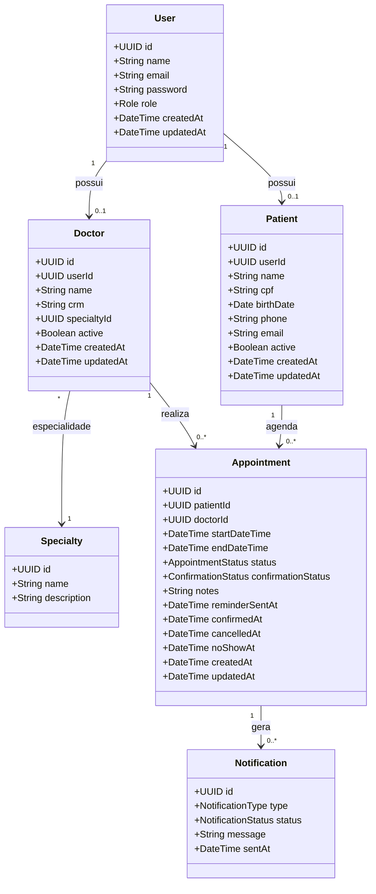

```mermaid
classDiagram

class User {
    +UUID id
    +String name
    +String email
    +String password
    +Role role
    +DateTime createdAt
    +DateTime updatedAt
}

class Patient {
    +UUID id
    +UUID userId
    +String name
    +String cpf
    +Date birthDate
    +String phone
    +String email
    +Boolean active
    +DateTime createdAt
    +DateTime updatedAt
}

class Doctor {
    +UUID id
    +UUID userId
    +String name
    +String crm
    +UUID specialtyId
    +Boolean active
    +DateTime createdAt
    +DateTime updatedAt
}

class Specialty {
    +UUID id
    +String name
    +String description
}

class Appointment {
    +UUID id
    +UUID patientId
    +UUID doctorId
    +DateTime startDateTime
    +DateTime endDateTime
    +AppointmentStatus status
    +ConfirmationStatus confirmationStatus
    +String notes
    +DateTime reminderSentAt
    +DateTime confirmedAt
    +DateTime cancelledAt
    +DateTime noShowAt
    +DateTime createdAt
    +DateTime updatedAt
}

class Notification {
    +UUID id
    +NotificationType type
    +NotificationStatus status
    +String message
    +DateTime sentAt
}

User "1" --> "0..1" Patient : possui
User "1" --> "0..1" Doctor : possui

Doctor "*" --> "1" Specialty : especialidade

Doctor "1" --> "0..*" Appointment : realiza
Patient "1" --> "0..*" Appointment : agenda

Appointment "1" --> "0..*" Notification : gera

```
